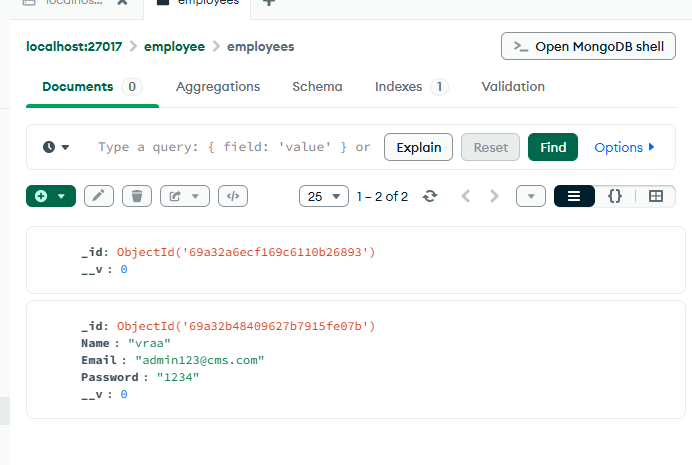
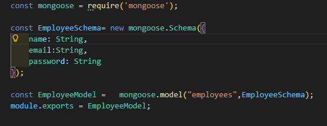
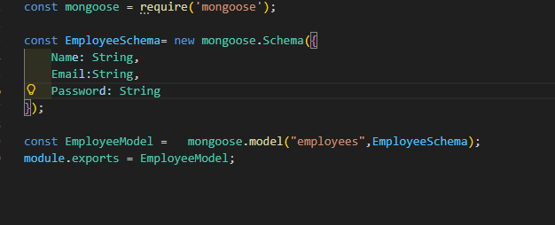

1. Not access the correct folder and installing package in root folder rather into subfolder.
2. install react-dom, we needed react-router-dom
3. forget to import BrowserRouter, and it also goes to main.jsx or there all the routing beginning.
4. BrowserRouter in Mainpartner component and all routes must pass inside the BrowserRouter.
5. Routes and sub-main parent where all the routes are running.
6. <Routes>
<Route path='/register' element={<Signup />}></Route>
<Route path='/login' element={<Login />}></Route>
</Routes>

7. 
    There we have posting the user input to mongooseDB localhost is server connection, and now {Name,Email,Password} is the data we are posting to the server.
    axios.post('http://localhost:3000/register',{Name, Email, Password  => this is the data we are posting to the server.})
    Error: 
    in backend , in Index.js
    Model> Employee.js
    I created a schema means a table in database that is rows and columns that will save the value
    
    Now as you can on 1st entry there is no data, because
    ;
    Inside i passing value in smallcase, but in
    axios.post("",{Name, Email, Password})
    I passing the value in capitalcase, so it will not save the value in database.
    
    So this one work only.